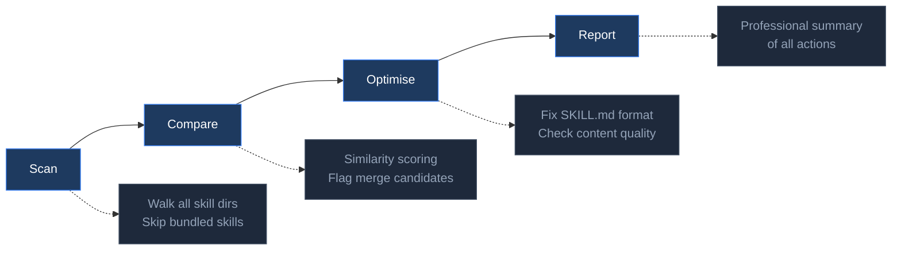

<p align="center">
  <br>
  <b>Skill Auto Maintain</b><br>
  <i>Find, organise, and clean up your Hermes Agent skills — automatically.</i>
</p>

<p align="center">
  <a href="LICENSE"></a>
  <a href="#"></a>
  <a href="#"></a>
  <strong>English</strong> · <a href="README_CN.md">中文</a>
</p>

> **Your `~/.hermes/skills/` is a mess.** Agent-created skills are scattered across `creative/`, `devops/`, `auto-generated/` — with no registry, no duplicate detection, no quality control.  
> Skill Auto Maintain scans everything, moves orphans to `user_skills/`, registers them, detects duplicates, and fixes broken SKILL.md files. One command, zero config. **Zero external dependencies — pure Python 3 standard library.**

<br>



<br>

<table>
<tr>
<td width="50%" valign="top">

### ❌ Before

```
~/.hermes/skills/
├── creative/
│   ├── architecture-diagram/
│   └── my-scraper        
├── devops/
│   ├── kanban-worker/
│   └── my-pipeline       
└── auto-generated/
    └── old-tool/
```

_Orphans scattered everywhere. No registry. No quality checks._

</td>
<td width="50%" valign="top">

### ✅ After

```
~/.hermes/skills/
├── creative/
│   └── architecture-diagram/
├── devops/
│   └── kanban-worker/
└── user_skills/
    ├── my-scraper/
    ├── my-pipeline/
    ├── old-tool/
    └── user_skills.json
```

_All orphans in one place. Registered. Tracked._

</td>
</tr>
</table>

<br>

## Quick Start

```bash
git clone https://github.com/jangyuxue/skill-auto-maintain.git
cp -r skill-auto-maintain/skill-auto-maintain ~/.hermes/skills/user-created/
```

Then in `hermes`:

- Type `/skill` and select **skill-auto-maintain** from the list, or
- Tell the agent: *"Run skill auto maintenance"*

<br>

## Features

<table>
<tr>
<td width="33%" align="center">

**🔍 Scan**

Walk every directory.  
Skip bundled skills.  
Migrate orphans.

</td>
<td width="33%" align="center">

**📊 Compare**

4-dimension similarity.  
Merge candidate detection.  
Manual review only.

</td>
<td width="33%" align="center">

**✨ Optimise**

Fix SKILL.md format.  
Quality checks.  
Professional report.

</td>
</tr>
</table>

<br>

## Project Structure

```
skill-auto-maintain/
├── README.md
├── README_CN.md
├── LICENSE
├── CHANGELOG.md
└── skill-auto-maintain/         ← Copy this folder to skills/
    ├── SKILL.md
    └── maintain.py
```

<br>

## License

MIT
