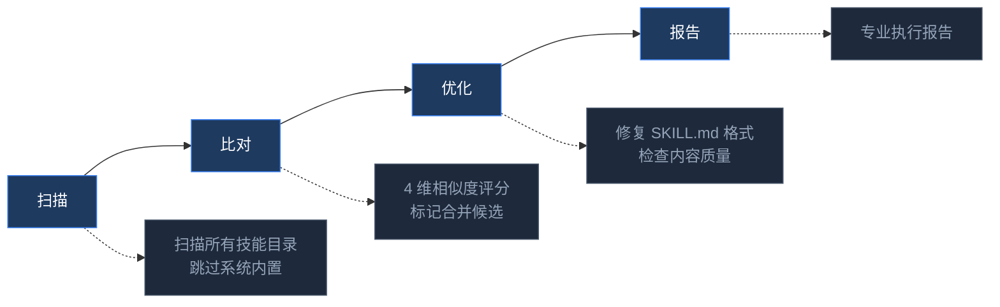

<p align="center">
  <br>
  <b>Skill Auto Maintain</b><br>
  <i>自动查找、整理和清理你的 Hermes Agent 技能。</i>
</p>

<p align="center">
  <a href="LICENSE"></a>
  <a href="#"></a>
  <a href="#"></a>
  <a href="README.md">English</a> · <strong>中文</strong>
</p>

> **你的 `~/.hermes/skills/` 一团乱麻。** Agent 创建的技能散落在 `creative/`、`devops/`、`auto-generated/` 等目录——没有注册表、没有重复检测、没有质量控制。  
> Skill Auto Maintain 扫描一切，将走丢技能搬到 `user_skills/`，注册登记，检测重复，修复异常的 SKILL.md。一条命令，零配置。**零外部依赖——纯 Python 3 标准库。**

<br>



<br>

<table>
<tr>
<td width="50%" valign="top">

### ❌ 之前

```
~/.hermes/skills/
├── creative/
│   ├── architecture-diagram/
│   └── my-scraper        
├── devops/
│   ├── kanban-worker/
│   └── my-pipeline       
└── auto-generated/
    └── old-tool/
```

_走丢技能散落各处。无注册表。无质量检查。_

</td>
<td width="50%" valign="top">

### ✅ 之后

```
~/.hermes/skills/
├── creative/
│   └── architecture-diagram/
├── devops/
│   └── kanban-worker/
└── user_skills/
    ├── my-scraper/
    ├── my-pipeline/
    ├── old-tool/
    └── user_skills.json
```

_全部集中在 user_skills/。已注册。已追踪。_

</td>
</tr>
</table>

<br>

## 快速上手

```bash
git clone https://github.com/jangyuxue/skill-auto-maintain.git
cp -r skill-auto-maintain/skill-auto-maintain ~/.hermes/skills/user-created/
```

然后在 `hermes` 里：

- 输入 `/skill` 从列表选择 **skill-auto-maintain**
- 或者告诉 agent：*"运行技能自动维护"*

<br>

## 功能

<table>
<tr>
<td width="33%" align="center">

**🔍 扫描**

遍历所有目录。  
跳过系统内置。  
迁移走丢技能。

</td>
<td width="33%" align="center">

**📊 比对**

4 维相似度评分。  
检测合并候选。  
仅报告，不自动合并。

</td>
<td width="33%" align="center">

**✨ 优化**

修复 SKILL.md 格式。  
内容质量检查。  
专业执行报告。

</td>
</tr>
</table>

<br>

## 项目结构

```
skill-auto-maintain/
├── README.md
├── README_CN.md
├── LICENSE
├── CHANGELOG.md
└── skill-auto-maintain/         ← 将此文件夹复制到 skills/
    ├── SKILL.md
    └── maintain.py
```

<br>

## 许可证

MIT
